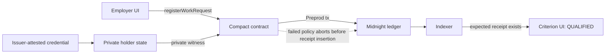

<p align="center">
  
</p>

<h1 align="center">Criterion</h1>

<p align="center"><strong>Commit the criteria first. Prove qualification privately.</strong></p>
<p align="center">A Commit-Before-Know private work qualification protocol on Midnight.</p>

<p align="center">
  <a href="https://faadil1.github.io/shieldrate/"><strong>Live App</strong></a>
  ·
  <a href="https://cdn.creativeclaw.co/u/f920e1ba/videos/eb72489e-4b21-4b1e-a1bd-b67796e9d4fb.mp4"><strong>90s Demo Video</strong></a>
  ·
  <a href="docs/JUDGE-REVIEW.md"><strong>Judge Guide</strong></a>
  ·
  <a href="evidence/network/V4-COMMIT-BEFORE-KNOW-PREPROD-2026-09-16.md"><strong>Network Evidence</strong></a>
  ·
  <a href="docs/DEMO-90S.md"><strong>Demo Script</strong></a>
</p>

<p align="center"><sub>Midnight Buildathon · Wave 1 · Preprod · NETWORK_VERIFIED</sub></p>

> **Current status**  
> Criterion completed a canonical Midnight Preprod run: provider registration, employer policy commit, private holder qualification, and indexed `QUALIFIED` receipt confirmation. The public evidence bundle contains no raw credential, issuer secret, holder secret, admin secret, or wallet seed/private key.

<p align="center">
  <a href="https://cdn.creativeclaw.co/u/f920e1ba/videos/eb72489e-4b21-4b1e-a1bd-b67796e9d4fb.mp4">
    
  </a>
  <br />
  <sub>▶ Watch the validated 90-second judge demo</sub>
</p>

## Why Criterion exists

### The pain

Hiring and contracting workflows often ask people to reveal more evidence than the decision actually needs: exact income history, ratings, job counts, or other work-profile details.

That data can outlive the original decision and become a profiling or negotiation surface.

### The problem

Hiding the worker's answer is not enough if the verifier can keep changing the question.

A private credential flow can still leak information when a verifier is allowed to try different thresholds after seeing outcomes. Criterion treats the verifier's criteria as part of the privacy boundary.

### Why Criterion is different

Criterion fixes one qualification policy for one employer + job scope **before** the holder proves anything.

- The employer commits one public policy code, challenge, nonce, and expiry.
- The committed employer/job slot cannot be silently replaced with another standard.
- The holder chooses whether to prove the already-registered policy.
- Provider-signed private work data is checked in Compact.
- A failed or refused qualification creates no holder-specific public negative receipt.
- A successful proof produces one opportunity-scoped `QUALIFIED` receipt.

**COMMIT → CONSENT → PRIVATE PROOF → QUALIFIED**

The product promise is simple: **prove you qualify for the work without publishing why.**

---

## The protocol

| Step | What happens |
|---|---|
| Commit | Employer registers one immutable qualification standard for the employer/job scope |
| Consent | Holder decides whether to prove against that already-committed standard |
| Private proof | Compact verifies provider signature, freshness, policy conditions, and scoped identity/nullifier |
| Qualified | Only a successful opportunity-scoped receipt is published |

Wave 1 demonstration policies:

| Policy | Public label | Private conditions |
|---|---|---|
| `SR-WORK-01` | Established work history | income > 40k, rating ≥ 4.0, jobs ≥ 50 |
| `SR-WORK-02` | Proven professional | income > 50k, rating ≥ 4.5, jobs ≥ 100 |
| `SR-WORK-03` | Elite track record | income > 80k, rating ≥ 4.9, jobs ≥ 200 |

These are protocol demonstration standards, not hiring recommendations.

---

## Execution

Criterion separates public request state, private credential state, proof execution, and indexed receipt confirmation.



- **Compact contract** enforces provider registration, committed work requests, fixed policy codes, time checks, scoped subjects/nullifiers, and pass-only receipts.
- **MidnightJS runtime** deploys/joins the live contract, submits transactions, and re-reads indexed ledger state.
- **Browser private-state provider** keeps holder/admin witness material outside the public evidence bundle.
- **Schnorr issuer verification** binds private credential values to a registered provider key.
- **Indexed receipt confirmation** is required before the live UI reports `QUALIFIED`.

See [`docs/ARCHITECTURE.md`](docs/ARCHITECTURE.md) for the compact technical map.

---

## Network evidence

Canonical Midnight Preprod run:

| Evidence | Value |
|---|---|
| Contract | `c67fcd95e1620693817a1248bceda34e507d39416a7e9c3038ad89f9844513d2` |
| Provider | `2`, epoch `0` |
| Provider registration tx | `00f51998e02cad86df03e65954de9c5ae53191f749ce71b11b74ebf260ecf79ea2` |
| Provider registration block | `2568791` |
| Job | `sr-wave1-canonical-2026-09-15-03` |
| Policy | `SR-WORK-02` / code `2` |
| Work request | `d7f42cc52438981bcd093e39c4e738004d9ff9b26af7348f4cea8abe690c9ed1` |
| Commit tx | `00a18b7182d20be241c81d1de17bfa8d1d84d1621c2da921b27a8714b57e0a8eee` |
| Commit block | `2575087` |
| Verification | `6eef4d8dfd28dcee6dd95502e4baf14b1838525fc8cc6b2b67c94d8c618583b1` |
| Qualification tx | `00aedb486f5ab66543f4c16bd90232566d6598bcde2829676ac4e782d098b1d836` |
| Qualification block | `2575167` |
| Indexed receipt | expected verification id confirmed in `workReceipts` before `QUALIFIED` |

Full evidence: [`evidence/network/V4-COMMIT-BEFORE-KNOW-PREPROD-2026-09-16.md`](evidence/network/V4-COMMIT-BEFORE-KNOW-PREPROD-2026-09-16.md).

| Area | Status |
|---|---|
| Live GitHub Pages app | Ready |
| Compact contract | Source-verified |
| Midnight Preprod deployment | Verified |
| Provider 2 registration | Verified |
| Commit-Before-Know request | Verified |
| Private qualification | Verified |
| Indexed positive receipt | Verified |
| Production issuer governance | Not claimed |
| Production authorization identity | Hardening required |
| Mainnet | Not claimed |

---

## What stays private

| Public | Private |
|---|---|
| employer/job-scoped request | exact income |
| fixed policy code | exact rating |
| request expiry | completed-job count |
| provider id / epoch | holder secret |
| positive scoped receipt | credential opening / issuer secret |

A failed proof does not publish which condition failed or how far the holder was from the threshold.

---

## Engineering challenges

### Fixing live time semantics

The first live qualification exposed a JavaScript milliseconds vs Midnight block-time seconds mismatch. The live issuance/request path now uses Unix seconds and the contract rejects future-issued credentials and expired requests.

### Making immutable criteria visible in the UI

A stale demo job id could reset after refresh and collide with an already-fixed employer/job slot. The live operator path now persists the active job id, preflights the employer/job key, and blocks the legacy demo scope from accidental reuse.

### Refusing transaction-only success

A finalized transaction is not enough. The runtime computes the expected verification id and checks indexed `workReceipts` before returning `QUALIFIED`.

### Keeping private evidence out of the submission

The canonical evidence bundle records contract/request/receipt identifiers and blocks, but intentionally excludes raw credential values and all private secret material.

---

## Truth boundary

Criterion is network-verified for the canonical Midnight Preprod run above. It does **not** claim:

- legal fairness or non-discrimination of a committed policy;
- production issuer governance, RBAC, billing, or webhooks;
- a guaranteed one-to-one mapping between a protocol `jobScope` and an external real-world requisition;
- production-grade employer authentication from `ownPublicKey()` alone.

The current contract derives employer scope from the Midnight public-key context exposed through `ownPublicKey()`. A production authorization design should use a stronger secret-witness-derived identity boundary.

---

## Repository guide

The public submission tree is intentionally compact:

- `contracts/` — Compact contract and Schnorr verification module
- `src/` — React product UI, MidnightJS runtime, private-state and integrity logic
- `tests/` — source and compiled-contract regression coverage
- `docs/` — judge guide, architecture, protocol rationale, demo path and claim ledger
- `evidence/network/` — privacy-safe canonical Preprod evidence
- `scripts/` — local credential/demo and asset utilities

Internal research, competitive analysis, design-process notes, operational handovers, recovery notes, and private working state are intentionally excluded from the submission tree.

Technical continuity: the repository name, deployed Compact contract, storage keys, package name, and some protocol identifiers retain the historical `shieldrate` / `SR-*` namespace. **Criterion** is the public product name.

---

## Development

```bash
npm ci
npm run verify:judge
npm audit --audit-level=moderate
```

Compact:

```bash
compact update 0.31.1
rm -rf .compact-build/shieldrate
compact compile --compact-path contracts contracts/shieldrate.compact .compact-build/shieldrate
```

## Team

- [`Faadil1`](https://github.com/Faadil1) — product / implementation
- [`opeblow`](https://github.com/opeblow) — collaborator / technical implementation

## Useful links

- [Live App](https://faadil1.github.io/shieldrate/)
- [Validated 90s Judge Demo](https://cdn.creativeclaw.co/u/f920e1ba/videos/eb72489e-4b21-4b1e-a1bd-b67796e9d4fb.mp4)
- [Judge Guide](docs/JUDGE-REVIEW.md)
- [Architecture](docs/ARCHITECTURE.md)
- [Commit-Before-Know](docs/COMMIT-BEFORE-KNOW.md)
- [Private Work Qualification](docs/WORK-QUALIFICATION.md)
- [Claim Ledger](docs/CLAIMS.md)
- [Canonical Network Evidence](evidence/network/V4-COMMIT-BEFORE-KNOW-PREPROD-2026-09-16.md)
- [Security](SECURITY.md)

## License

Apache-2.0. The Schnorr verification module preserves attribution for the Apache-2.0 Midnight `example-zkloan` pattern it is adapted from.
