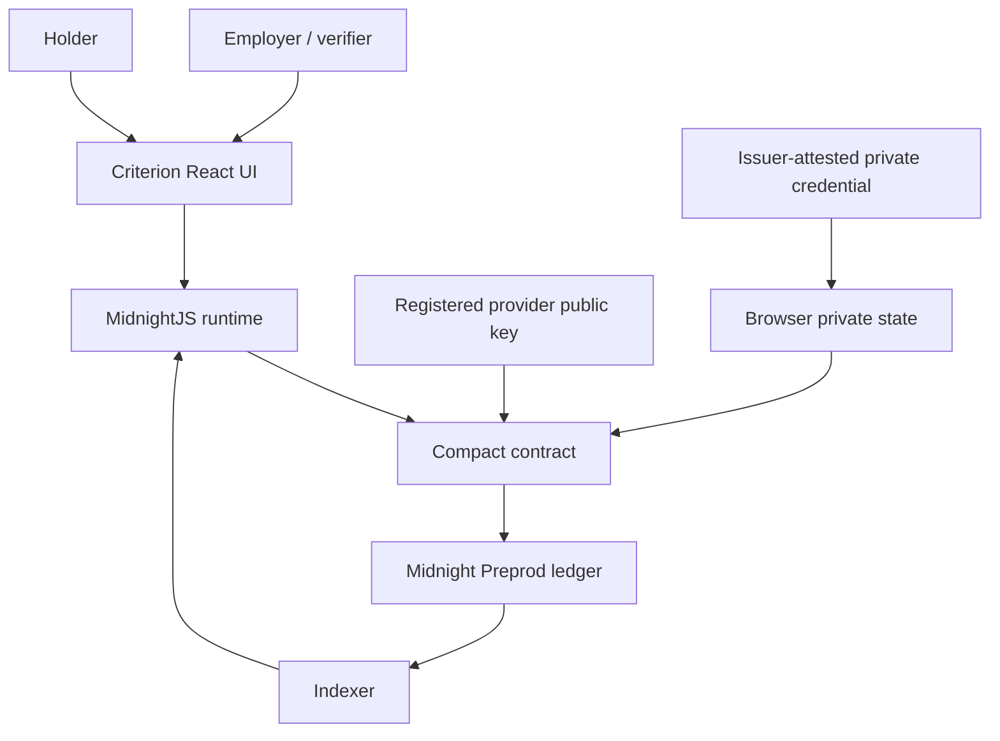

# Criterion Architecture

Criterion is a private work-qualification protocol built on Midnight. Its core rule is **Commit-Before-Know**: the verifier fixes the qualification policy before the holder proves anything.

## System map

## Contract responsibilities

`contracts/shieldrate.compact` owns the protocol invariants:

- registered provider public keys and monotonically advancing provider epochs;
- issuer Schnorr signature verification over the private credential;
- one fixed work request per employer + job scope;
- fixed public policy codes rather than proof-time arbitrary thresholds;
- Unix-seconds request and credential freshness checks;
- credential validity covering the full request window;
- employer/job-scoped holder subject derivation;
- opportunity-scoped nullifier derivation;
- pass-only `WorkQualificationReceipt` insertion.

The contract aborts before public receipt insertion when a policy check fails.

## Commit-Before-Know

`registerWorkRequest(...)` stores a request containing:

- employer public-key scope derived from the Compact context;
- job scope;
- policy code;
- challenge;
- request nonce;
- expiry.

`jobRequests` permanently occupies the employer + job key. Cancelling a request closes it but does not reopen the slot for a replacement standard.

`verifyRegisteredWorkPolicy(workRequestId)` loads the already-registered request. It does not accept a new proof-time policy.

## Private state

The browser-side Midnight private-state provider carries holder/admin witness material and the imported issuer-attested credential. Those values are not part of the public network evidence bundle.

Public evidence contains protocol identifiers, transaction ids, blocks, and the positive receipt only.

## Live runtime

The MidnightJS runtime uses a controlled lifecycle for public request submission and reconciliation. The live UI reports success only after:

1. transaction submission/finalization;
2. the expected verification id is derived;
3. indexed `workReceipts` is queried;
4. the expected receipt is confirmed present.

This prevents a submitted or finalized transaction from being presented as a successful qualification without indexed state confirmation.

## Canonical Preprod deployment

Contract:

`c67fcd95e1620693817a1248bceda34e507d39416a7e9c3038ad89f9844513d2`

Canonical proof chain:

`provider 2 indexed → employer policy committed → private holder qualification → indexed QUALIFIED receipt`

See [`../evidence/network/V4-COMMIT-BEFORE-KNOW-PREPROD-2026-09-16.md`](../evidence/network/V4-COMMIT-BEFORE-KNOW-PREPROD-2026-09-16.md).

## Security boundary

The current contract derives employer scope from the public-key context exposed through `ownPublicKey()`. That supports the bounded Preprod demonstration but is **not claimed as the final production authentication boundary**. A production authorization design should move identity-sensitive authorization to a stronger secret-witness-derived scheme.
